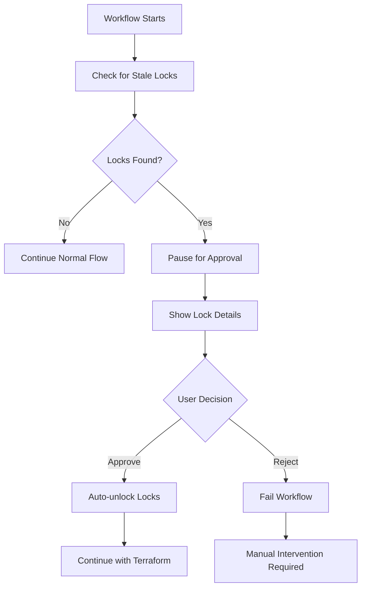

# 🔓 Stale Lock Approval System Setup

## Overview
This system provides interactive approval for removing stale Terraform locks through GitHub Actions.

## 🛠️ Setup Instructions

### 1. Create GitHub Environment

1. Go to your repository: **Settings** → **Environments**
2. Click **"New environment"**
3. Name: `stale-lock-approval`
4. Click **"Configure environment"**

### 2. Configure Environment Protection

1. **Required reviewers**: Add yourself (and any team members)
2. **Wait timer**: 0 minutes (optional)
3. **Deployment branches**: Choose your preference
4. Click **"Save protection rules"**

### 3. Test the System

1. **Trigger a workflow** (deploy/destroy)
2. **If stale locks exist**: Workflow will pause at "Approve Stale Lock Removal"
3. **Review details**: Check the job summary for lock information
4. **Approve or reject**: Use the GitHub interface
5. **Automatic unlock**: If approved, locks are removed automatically

## 🎯 How It Works

### When Stale Locks Are Detected:



### Approval Interface Shows:

- **Lock ID**: Unique identifier for the stale lock
- **Operation**: What operation created the lock (Plan/Apply/Destroy)
- **Created**: When the lock was created
- **Who**: Which runner/user created the lock
- **Analysis**: Why the lock might be stale
- **Safety checklist**: What to verify before approving

## 🚨 When to Approve

### ✅ Safe to Approve:
- Lock is from a cancelled/failed workflow
- No other Terraform operations are running
- Lock is more than 30 minutes old
- You recognize the lock from a recent cancelled operation

### ❌ Do NOT Approve:
- Another deployment is currently running
- You're unsure about the lock's origin
- The lock is very recent (< 5 minutes old)
- Multiple team members are deploying simultaneously

## 🔧 Manual Override

If you need to skip the approval system:

```bash
# Local unlock (emergency only)
terraform force-unlock [LOCK_ID]

# Or run the detection script locally
cd terraform
./cleanup_stale_locks.sh
```

## 🛡️ Security Notes

- Only authorized reviewers can approve lock removal
- All approvals are logged in GitHub Actions
- Lock details are fully visible before approval
- System fails safely if approval is rejected

## 📊 Benefits

- **No more manual CLI unlocking**
- **Full visibility** into lock details
- **Audit trail** of all unlock decisions
- **Team coordination** through GitHub interface
- **Prevents accidental unlocks** of active operations

The system transforms stale lock management from a manual CLI task into a **safe, auditable, web-based approval process**! 🎯 